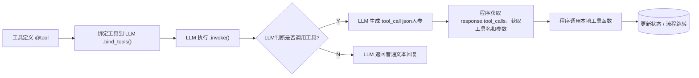

# run

https://docs.tavily.com/documentation/quickstart#get-your-free-tavily-api-key

```bash

# 克隆仓库
git clone https://github.com/bytedance/deer-flow.git
cd deer-flow

pip install uv
# 安装依赖
uv sync

# 配置 .env 文件
cp .env.example .env

# 配置 conf.yaml 文件
cp conf.yaml.example conf.yaml

# 安装 marp 用于生成 PPT
# brew install marp-cli

# 控制台调用
uv run main.py
# 输入问题：what is llm?

# 使用 uvicorn web 服务器，开放 http 接口
uv run server.py

```

# 调用链
[server.py](server.py)
[src/graph/builder.py](src/graph/builder.py)
- podcast：[src/podcast/graph/builder.py](src/podcast/graph/builder.py)
- ppt：[src/ppt/graph/builder.py](src/ppt/graph/builder.py)
- 文本处理：[src/prose/graph/builder.py](src/prose/graph/builder.py)

# llm

## function call

代码：[src/graph/nodes.py#coordinator_node](src/graph/nodes.py#coordinator_node)


| 阶段 | 关键操作 |
|------|----------|
| 声明工具 | 使用 `@tool`装饰器定义tool |
| 绑定工具 | 使用 `.bind_tools([...])` |
| llm 触发调用 | llm 根据 Prompt 决策并生成 `tool_call`的工具名和入参 |
| 程序 执行调用 | 程序 `response.tool_calls` 获取工具名和入参，调用工具 |



1. 工具定义：用`@tool`装饰器，将handoff_to_planner 函数注册为一个 LangChain 工具 ，LLM 可以在响应中通过 `.tool_calls` 调用它。
```python
@tool
def handoff_to_planner(...):
    ...
```
2. 绑定工具到 LLM
```python
response = (
    # 获取 LLM 实例
    get_llm_by_type(AGENT_LLM_MAP["coordinator"])
    # 绑定 tool 到 LLM
    .bind_tools([handoff_to_planner])
    # LLM 根据提示词决定是否调用该工具，并将结果保存在 `response.tool_calls` 中
    .invoke(messages)
)
```
3. 模型触发调用 tool_call ，条件是：
- 模型能力：使用的模型必须支持工具调用（如 GPT-4、GPT-3.5 Turbo 等）。
- Prompt 提示：你在 prompt 中是否明确指示模型可以/应该调用某些工具。
- 工具描述清晰度：工具的 docstring 和参数是否能让 LLM 正确理解其用途。
例如，在 coordinator 的 prompt 中，应包含类似下面的内容，引导模型调用工具：

```plaintext
You are the Coordinator agent.
If you need to start planning, call the 'handoff_to_planner' function with the task title and user locale.

{
  "tools": [
    {
      "type": "function",
      "function": {
        "name": "handoff_to_planner",
        "description": "Handoff to planner agent to do plan.",
        "parameters": {
          "type": "object",
          "properties": {
            "task_title": {
              "type": "string",
              "description": "The title of the task to be handed off."
            },
            "locale": {
              "type": "string",
              "description": "The user's detected language locale (e.g., en-US, zh-CN)."
            }
          },
          "required": ["task_title", "locale"]
        }
      }
    }
  ]
}
```


4. 获取结果
通过 `response.tool_calls` 获取工具名和入参，执行工具调用。
```json
{
  "name": "handoff_to_planner",
  "args": {
    "task_title": "帮我写一份关于气候变化的研究计划",
    "locale": "zh-CN"
  }
}
```


